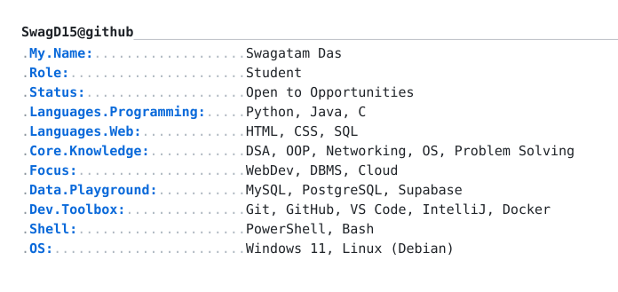
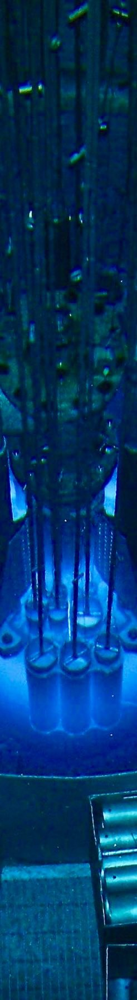
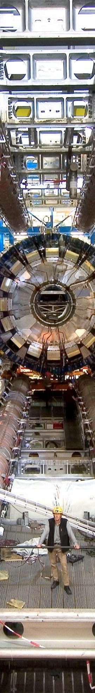

<table width="100%" align="center">
  <tr>
    <td width="10%" align="left">
      
    </td>

  <td width="90%" align="center">
      
    </td>
  </tr>
</table>

##  Skills and Technologies

  

  

##  Most Used Languages and Stats

<table width="100%" align="center">
  <tr>
    <td width="65%" align="center">
      
    </td>

  <td width="35%" align="center">
      
    </td>
  </tr>
</table>

 

  
  
  
  
  
  
  
  
  
  
  
  
  

 

